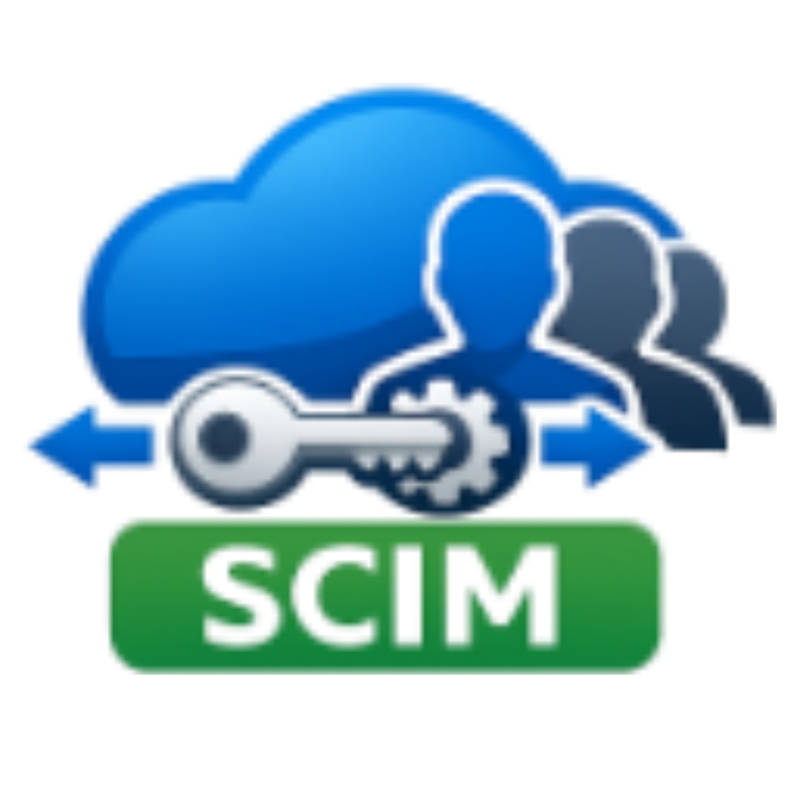

<div align="center">
  

  # EzSCIM

  **SCIM 2.0 server implementation for ASP.NET Core**

  [](https://github.com/miiitch/EzSCIM/actions/workflows/ci-release.yml)
  [](https://www.nuget.org/packages/EzSCIM)
  [](https://www.nuget.org/packages/EzSCIM.EfCore)
  [](LICENSE)
</div>

---

EzSCIM lets you add a **SCIM 2.0 provisioning endpoint** to any ASP.NET Core application in minutes.
It is compatible with **Microsoft Entra ID** (Azure AD) automatic user provisioning.

## Features

- ✅ Full SCIM 2.0 Users and Groups endpoints (GET, POST, PUT, PATCH, DELETE)
- ✅ SCIM filter translation to LINQ — works with any data source
- ✅ Schema extensions via `[ScimProperty]` attribute
- ✅ JWT Bearer authentication out of the box
- ✅ EF Core base repository with zero-boilerplate CRUD
- ✅ Multi-provider support (SQL Server, PostgreSQL, …)
- ✅ Microsoft Entra ID provisioning verified

## Choose your integration model

| | `EzSCIM` | `EzSCIM` + `EzSCIM.EfCore` |
|---|---|---|
| **Data source** | Any (IQueryable) | Entity Framework Core |
| **Setup** | Implement `IUserGroupDataRepository<TUser, TGroup>` | Inherit `EfScimRepositoryBase<TUser, TGroup, TContext>` |
| **Best for** | Dapper, Cosmos DB, MongoDB, custom repositories | EF Core / DbContext |

## Quick start (EF Core model)

```bash
dotnet add package EzSCIM
dotnet add package EzSCIM.EfCore
```

```csharp
// Program.cs
builder.Services.AddEzScim<MyUser, MyGroup>();
builder.Services.AddScoped<IScimRepository, MyRepository>();
builder.Services.AddJwtTokenService(builder.Configuration);

app.MapScimEndpoints();
```

```csharp
// MyRepository.cs
public class MyRepository : EfScimRepositoryBase<MyUser, MyGroup, MyDbContext>
{
    public MyRepository(MyDbContext context) : base(context) { }
}
```

→ **[Full documentation](https://miiitch.github.io/EzSCIM)**

## Documentation

| Topic | Link |
|---|---|
| Getting started (IQueryable) | [docs/public/iqueryable/getting-started.md](docs/public/iqueryable/getting-started.md) |
| Getting started (EF Core) | [docs/public/efcore/getting-started.md](docs/public/efcore/getting-started.md) |
| Authentication | [docs/public/authentication.md](docs/public/authentication.md) |
| SCIM 2.0 attribute reference | [docs/public/iqueryable/scim-attributes.md](docs/public/iqueryable/scim-attributes.md) |
| Architecture (contributors) | [docs/internal/architecture.md](docs/internal/architecture.md) |
| Changelog | [CHANGELOG.md](CHANGELOG.md) |

## Contributing

Contributions are welcome! Please read the [contributor guide](docs/internal/README.md) before submitting a PR.

All code, comments, and documentation must be in **English**.

## License

MIT — see [LICENSE](LICENSE).
